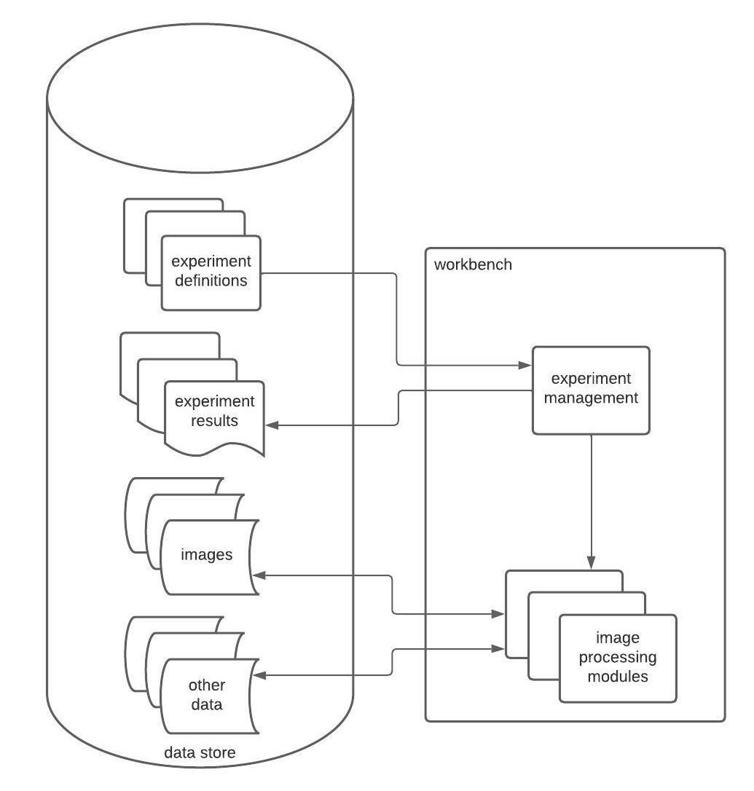
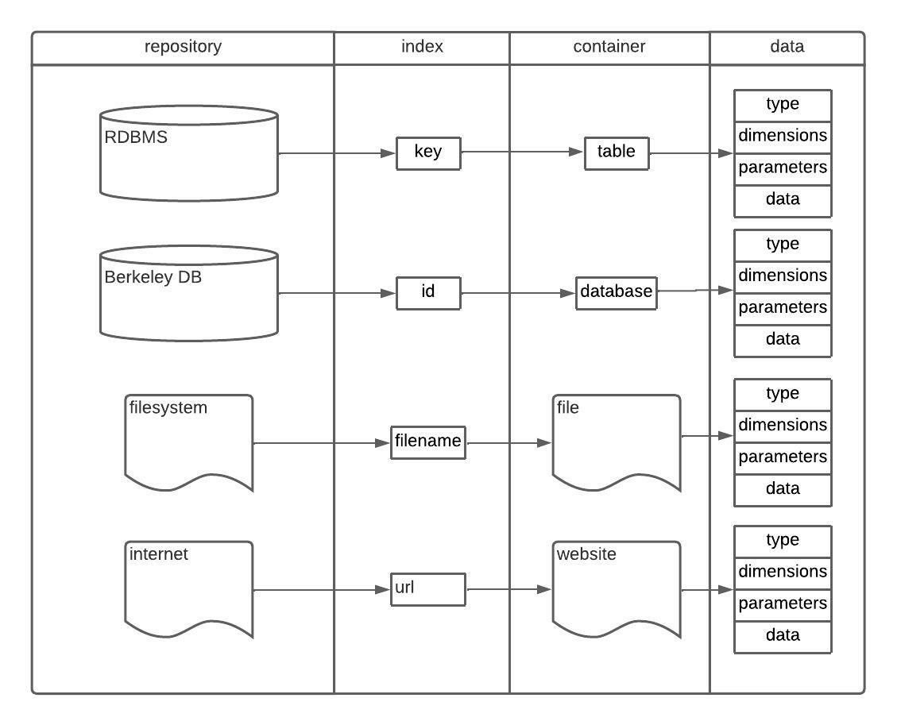
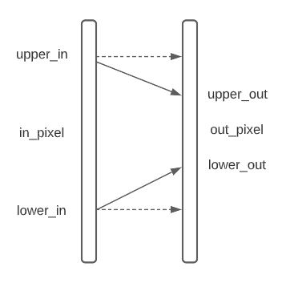

# CV-Workbench

This describes the Computer Vision Workbench, 
a software system that allows a non-programmer to do experimentation with image processing. 


## Outline
- Overview
- Purpose
- Components
- Discussion
- References

## Overview

Computer vision is an experimental activity.
The goals is to determine the contents of a scene from a two-dimensional image, 
given that it provides limited view of a three-dimensional scene.
Images are processed and analyzed to detect possible features.
Features extracted in the image are correlated with possible objects in the scene.
Image operators transform images to produce values that can indicate that various features are present.
Each operator has a number of parameters to tailor its function.
Developing computer vision algorithms involves creating sequences
of image operations and associated parameters that extract image features,
and evaluating how accurately they produce symbolic representations of what is seen in the image.

The CV-Workbench is a framework to perform reproducible computer vision experiments. 
Users define experiment steps and store them allowing experiments to easily be reproduced.
An experiment management module guides runs image processing operations.
Image processing modules run with the specified input images and parameters.
Output images and data are stored on completion with experiment results including notes and explanations.
Experiments can be shared between CV-Workbench instances installed on different machines.

## System usage
Operation scripts allow experiments to be accurately reproduced to be able to 
compare results using different images. 
This is in contrast to performing interactive operations with a program such as GIMP,
where steps are controlled manually, slower and less reliable.
It is non-interactive and runs from the command line, unlike Gimp,
but that makes it reproducible and easier to modify experiments and rerun them.
It is like ImageMagick, but uses json to configure operations so it can have more knobs and dials to control processing.
It will store the results and generated data from experiments so reviewing the results is easier and more organized.
It will provide a number of built in functions,
though initially primarily ones that are oriented toward the edge and linear feature detection I'm doing.
It is extendable and can provide OpenCV functions,
but it doesn't use OpenCV functions right now because it is not necessary for the current experiments,
though it could be rewritten to do everything in OpenCV if that is useful.
It is something I have needed/would have found useful in the past, and I now have time to write it.
We'll talk when you get back if this is something interesting to you.



Image and other data may reside in different data stores. 
Each data store is accessed by a different method.
- Relational databases (RDBMS) can be accessed by a key for each data item. The data is likely
stored in a *binary large object* (BLOB) associated with the key.
- Berkeley DB is a non-relational database where each data item can be accessed by an id.
- Data can reside in files on the filesystem, where the filename identifies where to access the data.
- The Internet can provide data via a *URL* that sends data. This usually is a read-only access.  



Each data item consists of various components.
- The type of data being stored, e.g., images, histograms, etc.
Experiment definitions may be stored in any data store, 
though simplest is to store them in a file.
- The dimensions of the data, if relevant. 
This include image size and pixel bit width,
histogram bucket count and value range, etc.
- Other parameters of the data.
- The data itself, stored as binary or text.

The non-binary portions of the data will usually be stored as [JSON](https://json.org).
JSON allows a flexible format for data, and allows easily changing
the contents and format as needed.

## Prerequisites
The software is assumed to run under Linux [Ubuntu](https://ubuntu.com/) or compatible Linux version, 
such as Microsoft WSL2 [Pengwin](https://www.whitewaterfoundry.com/).
The following Linux modules need to be installed.

### gcc and g++
Install the `gcc` and `g++` build utilities with:
```
$ sudo apt install build-essential
```
### Json-c
Install the Json-c C/C++ Json parsing library under Linux with:
```
sudo apt install libjson-c-dev
```
or 
```
sudo apt-get install libjson0 libjson0-dev
```

- It can be cloned and built from [source](https://github.com/json-c/json-c) (cv-workbench was developed using this). 
- See the json-c [documentation](https://json-c.github.io/json-c/)
and [reference](https://json-c.github.io/json-c/).
- See the json-c [tutorial and examples](https://linuxprograms.wordpress.com/category/json-c).
- See an additional [tutorial](https://github.com/rbtylee/tutorial-jsonc)
with these [examples](https://github.com/rbtylee/tutorial-jsonc/blob/master/tutorial/index.md).
- See JSON [documentation](https://www.json.org/json-en.html) at [json.org](https://www.json.org/json-en.html).
- JSON can be formatted on a [website](https://jsonformatter.org/), 
with the [jq](https://stedolan.github.io/jq/download/) command-line app,
or in some IDEs such as [notepad++](https://notepad-plus-plus.org/) or JetBrains [Clion](https://www.jetbrains.com/clion/).
- Compile jcson-c C source files with the `json-c/json.h` include file
and link with `-ljson-c`.

### Berkeley DB
Install the Berkeley DB open source embedded database system from the zip
[source](https://www.oracle.com/database/technologies/related/berkeleydb-downloads.html)
with these [instructions](https://docs.oracle.com/cd/E17076_05/html/installation/index.html).
- See alternate install [instructions](https://cryptoandcoffee.com/mining-gems/install-berkeley-4-8-db-libs-on-ubuntu-16-04)
for the freesource version.
- You make need to install these packages:
```
sudo apt install autoconf libtool
```
- See the Oracle Berkeley DB [documentation](https://docs.oracle.com/cd/E17276_01/html/programmer_reference/index.html).
- Other documentation is at [DZone](https://dzone.com/refcardz/getting-started-oracle)
- See Berkeley DB [tutorials](https://web.stanford.edu/class/cs276a/projects/docs/berkeleydb/reftoc.html)
and [sample applications](https://www.oracle.com/database/technologies/related/berkeleydb.html).
- Compile Berkeley C source files with the `db.h` include file 
and link with `-ldb`.

### JPEG support
Install the [Independent JPEG Group](http://www.ijg.org/) `jpeg-9e` library
from [source](http://www.ijg.org/files/) 
(also from [github](https://github.com/LuaDist/libjpeg)).
- See the source [documentation](http://www.ijg.org/files/README).
- There is a [wiki](https://jpegclub.org/) and more [documentation](https://en.wikipedia.org/wiki/Libjpeg).
- See the JPEG [documentation](https://jpegclub.org/reference/reference-sources/).
- There is an `example.c` file in the source that is an example of using the library.
- Compile `jpeg-9e` C source files with the `jpeglib.h` include file and link with `-ljpeg`.

### OpenCV
Install the [OpenCV](https://docs.opencv.org/4.5.3/d7/d9f/tutorial_linux_install.html) 
open source computer vision package to develop workbench applications with [OpenCV](https://opencv.org).
- See the OpenCV [documentation](https://docs.opencv.org/).
- Compile OpenCV C++ source files with the `opencv2/opencv.hpp` include file
  and link with various `-lopencv_*` libraries found in `/usr/local/lib`.

### Sqlite3
Install the embedded relational database [Sqlite3](https://www.sqlite.org/) under Linux with:
```
sudo apt install sqlite3
```

- It can be built from [source](https://www.sqlite.org/2022/sqlite-amalgamation-3380500.zip).
- See these [build](https://www.sqlite.org/howtocompile.html) instructions.
- A Windows [ODBC driver](http://www.ch-werner.de/sqliteodbc/)
can be installed for use by, e.g., Microsoft Access.
- See the sqlite3 [tutorial](https://www.sqlitetutorial.net/).
- See the [sqlite3](https://www.sqlite.org/docs.html) and
  [C/C++ API](https://sqlite.org/cintro.html) documentation
with a [tutorial](https://www.sqlite.org/c_interface.html),
an [example](https://sqlite.org/src/file/src/shell.c.in),
and [source files](https://sqlite.org/src/file/src).
- Compile sqlite3 C source files with the `sqlite3.h` include file
  and link with the `sqlite3.o` file generated from the above
  [source](https://www.sqlite.org/2022/sqlite-amalgamation-3380500.zip)
with:
```
gcc -c sqlite3.c
```
- See these examples of building apps with 
[sqlite3](https://www.devdungeon.com/content/compiling-sqlite3-c).

### ESP32-CAM
To use the Arduino ESP32-CAM for image input, install the Arduino 
[ESP32-CAM module](https://www.edgoad.com/2021/02/programming-esp32cam-using-arduino-uno.html) in the [Arduino IDE](https://www.arduino.cc/en/software).
- See the ESP32-CAM camera webserver [still photo capture](https://github.com/kushnertodd/CameraWebServer-still) project.

## Experiments

Experiments involve a number of *steps* that each correspond to a vision operator.

## Operators

A number of classic vision operators exist within various *domains*.

### Operator Domains

Vision operator domains include:

- filters: pixel-level operators that transform pixels or make computations on pixel neighborhoods that are stored in
  pixels.
- correlation: matching features or patterns of image values to image.
- feature detection: region-level operators to detect and characterize arbitrary shaped areas in images.
- binary operators: transformations of binary images
- histogram operators: creating, transforming, or extracting. parameters of histograms.
- image operators: various image-wide transforms.
- geometric operations: projecting images based on different viewing geometries.

### Operator classes

Operator classes are specific groups of operators as suggested under *domains* above.

- filters
    - edge detectors
    - convolutions
    - thresholding
- correlation
    - feature matching
    - pattern matching
- feature detection
    - region growing and classification
    - hough line and generalized shape detection
- binary operators
    - morphological operations
- histogram operators
    - histogramming pixel values
    - histgramming feature values
    - histogram equilization
    - threshold selection
- image operators
    - image transforms
    - image coding
    - image compression
- geometric operators
    - resampling
    - warping
    - pyramids

### Operator instances

Specific algorithms within operator classes. Examples are:

- edge operators: Sobel, Prewitt, Roberts, difference of gaussian, laplacian, etc. plus thresholding
- convolution operators: smoothing, singular value decomposition
- thresholding: direct, adaptive
- image operators: fourier transforms, sine transforms


# CV-Workbench v0.1

The *CV-Workbench* is a framework to perform reproducible
computer vision experiments. 
A record of the input sources,
processing done, 
and output results will be kept such that experiments
can be reproduced. 
Notes can be retained for individual experiment
runs. 
Experiments can be shared between CV-Workbench instances
installed on different machines.

## Experiments
Each experiment consists of:
- zero or more input images or data structures
- processing steps consisting of computer vision *operators*
- zero or more output image or data structures

Processing steps will be individual command lines
that specify the inputs, an operator, and outputs.
Storing steps as command lines permits storing them
in files as scripts, making reproducing the experiment
more reliable. 
All parameters for a processing step will be specified
on the command line.
Command *templates* will control verifying that
the necessary and correct parameters are specified.
The parameters used in an operation, with the inputs
and outputs, will be stored in the experiment record.

## Data Structures
Computer vision operators each act on specific vision data 
structures.
Among these are:
- images (grayscale, binary, and color)
- histograms
- features
- regions

Each of these may have subtypes and various attributes, such as
that images and histograms have a given size,
features may be points from an edge operator or lines from 
a Hough transform, regions may be boundary points or
fixed geometric regions.
Operators will expect input data structures of the 
right subtypes and valid attributes, and
produce data structures with arbitrary definitions.

Each data structure will be stored before input to the
operator and saved on output.
The characteristics will be stored with the data structures.

## Operators
Each operator corresponds to a standard computer vision
operator supported by CV-Workbench.
Not provided are:
- user defined computer vision operators (unless added to the
  CV-Workbench code)
- having logic control performing the operators
- permit running operators multiple times

These may be added in a later version.

CV-Workbench operators are grouped by a hierarchy of types.
- Operator *domains* are the most general grouping, 
including filtering, matching, morphological, or histogramming.
- Operator *classes* are the next level of grouping, 
such as for the filtering domain, 
including edge detectors, convolutions, thresholding,
or intensity mapping.
- Operator *instances* are the next level, such as for
edge detectors, including Sobel, Roberts, Prewitt, 
- or Kirsch operators.

Operators will have parameters that will control
the kinds of required input characteristics,
the details of the operator processing involved,
and the characteristics of the output produced.

# Experiment Commands
Each command will be a line in a text script.
The format of a command will be:

*command* parameter1 parameter2 ...

The parameters for a command will 
be specified in *templates* describing
each parameter.
The template will determine whether a 
parameter is required, 
the type and constraints on a parameter's value,
and whether a default is available for optional
parameters.
Command functions will include:
- Reading, storing, and modifying input and output data structures.
- Performing computer vision operators on data structures and 
recording results.
- Various maintenance functions such as deleting data
structures, 
creating or removing storage locations,
producing reports from experiments.

## Command Templates
Command templates will be provided for each available workbench
command.
Templates will be stored as *JSON*, 
making them convenient to read to form commands
and store.
Knowledge of [JSON](https://www.json.org/json-en.html) 
will be required to read them.

Command formats will change over time.
Each format change will be recorded as
a different version of a template. 
Every version of a template will be stored
so that previous experiment scripts will still run.
Upgrading scripts to latest versions of templates
will be a task for the experimenter.
The changes involved in the new version,
and instructions to change the scripts,
will be provided when a new version is produced.

### Template format
Each operator template will have the same general format.
Templates will specify:
- a unique id for the template, used to retrieve the stored template.
- the domain, class, and instance of the operator involved.
- an optional comment.
- each possible parameters, including:
  - the parameter name specified in the command.
  - an optional comment.
  - whether the parameter is required.
  - the parameter value data type.
  - the permitted range for numeric values.
  - the permitted values for text values.
  - default value for optional parameters.

These will vary for different operators. 
Each command performing an operator must have a valid name.
```
{
  "operator-name-1": {
    "id": 1,
    "domain": "string",
    "class": "string",
    "instance": "string",
    "_comment1": [
      "line1",
      "line2"
    ],
    "parameters": [
      {
        "_comment1": [
          "line1",
          "line2"
        ],
        "name": "parameter-1",
        "required": "true|false",
        "data-type": "int|real|string|boolean",
        "range": {
          "min-value": "value",
          "max-value": "value"
        },
        "valid-values": [
          "value-1",
          "value-2"
        ]
        "default": "value",
      },
      {
        "name": "parameter-2, etc."
      }
    ]
  }
}
```

## Command Parameters
In the record of an experiment,
the operators performed and the actual parameters used
in the operators will be stored. 
They will be recorded as JSON text
with parameters matching the template format for them.

## Operator Parameters JSON

These will vary for different operators.
Each command performing an operator must have a valid name.
A generic operator parameter definition would be this.
It defines the attributes required,
their types,
and constraints on the parameters such as whether they are required or default value if omitted,
and allowed value range or permitted values if applicable.
```
{
  "_comment": [
    "string, etc."
  ],
  "id": 1,
  "domain": "string",
  "class": "string",
  "instance": "string",
  "input-data": {
  },
  "output-data": {
  },
  "parameters": [
    {
      "_comment": [
        "string, etc."
      ],
      "name": "string",
      "required": "true|false",
      "data-type": "int|real|string|boolean",
      "default": "string",
      "range": {
        "min-value": "string",
        "max-value": "string"
      },
      "valid-values": [
        "string",
        "string"
      ]
    },
    {
      "name": "string, etc."
    }
  ]
}
```

## Image format
Image formats will conform to __OpenCV__ so that operators can be implemented
through the __OpenCV__ API if desired.
For example, image formats will be specified using __OpenCV__ pixel types as follows.

|depth|bit-width|type-specifier|minimum|maximum
|-----|---------|--------------|-------|-------
|cv_enums::CV_8U|8|unsigned|0|255
|CV_8S|8|signed|-128|127
|CV_16U|16|unsigned|0|65535
|CV_16S|16|signed|-32768|32767
|cv_enums::CV_32S|32|signed|-2147483648|2147483647
|cv_enums::CV_32F|32|float|-FLT_MAX|FLT_MAX
|CV_64F|64|float|-DBL_MAX|DBL_MAX


Images may be stored on the filesystem in 
[JPEG](http://www.ijg.org/) format,
which permits easily viewing images. 
Other images will be stored in 
binary format, which cannot be directly viewed but can be used
as input to any image operator.
JPEG images are limited to unsigned 8 bit format so 
pixel values are limited to 0 to 255.
# Operators
These are the supported operators, input, parameters, and results.

## Transform operators
These are operators that transform image in some way to a new image.

### Transform Intensity operators
These are operators that transform image pixels to different values.

#### Transform Itensity map operators
These are operators that perform a linear scaling on image pixels. The parameters are:

|Parameter|Description|Default
|---------|-----------|-------
|depth|output image depth, e.g., cv_enums::CV_8U, cv_enums::CV_32F.|same as input image
|lower_in|lower input image pixel value
|upper_in|upper input image pixel value
|lower_out|lower output image pixel value
|upper_out|upper output image pixel value

This shows the pixel intensity mapping. 

- If the input pixel value is <= lower_in, the output pixel values is out_lower
- If the input pixel value is >= upper_in, the output pixel values is out_upper
- Else, the output pixel value is:  
`lower_out + (pixel in - lower_in) * (upper_out - lower_out) / (upper_in - lower_in)`



That is, all pixel values less than lower_in are *clipped* to lower_out, 
all pixel values greater than upper_in are *clipped* to upper_out,
and all others are scaled by the equation above.

When the output image depth is cv_enums::CV_8U,
when the input image depth is cv_enums::CV_32S or cv_enums::CV_32F 
are copied to the
output image, pixel values from 0 to 255 are copied properly
but the result of copying pixel values < 0 or > 255 are undefined.

If no parameter scaling is specified,
the image pixel values are copied from input to output unchanged.
This can be useful for reformatting an image from, e.g.,
jpeg to binary or the reverse.

