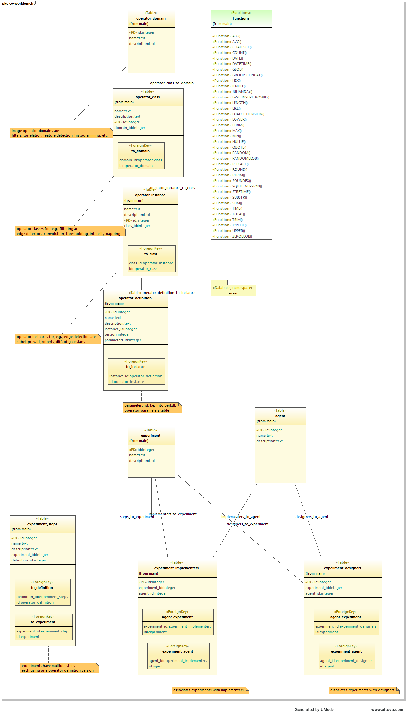

# cv-workbench

Computer vision experimentation workbench

## Overview

Computer vision is an experimental science. Developing computer vision algorithms involves experimentation with
vision [*operators*](#fn_operator) and finding appropriate parameters to measure the characteristics of interest in
images.

## Experiments

Experiments involve a number of *steps* that each correspond to a vision operator.

## Operators

A number of classic vision operators exist within various *domains*.

### Operator Domains

Vision operator domains include:

- filters: pixel-level operators that transform pixels or make computations on pixel neighborhoods that are stored in
  pixels.
- correlation: matching features or patterns of image values to image.
- feature detection: region-level operators to detect and characterize arbitrary shaped areas in images.
- binary operators: transformations of binary images
- histogram operators: creating, transforming, or extracting. parameters of histograms.
- image operators: various image-wide transforms.
- geometric operations: projecting images based on different viewing geometries.

### Operator classes

Operator classes are specific groups of operators as suggested under *domains* above.

- filters
    - edge detectors
    - convolutions
    - thresholding
- correlation
    - feature matching
    - pattern matching
- feature detection
    - region growing and classification
    - hough line and generalized shape detection
- binary operators
    - morphological operations
- histogram operators
    - histogramming pixel values
    - histgramming feature values
    - histogram equilization
    - threshold selection
- image operators
    - image transforms
    - image coding
    - image compression
- geometric operators
    - resampling
    - warping
    - pyramids

### Operator instances

Specific algorithms within operator classes. Examples are:

- edge operators: Sobel, Prewitt, Roberts, difference of gaussian, laplacian, etc. plus thresholding
- convolution operators: smoothing, singular value decomposition
- thresholding: direct, adaptive
- image operators: fourier transforms, sine transforms

